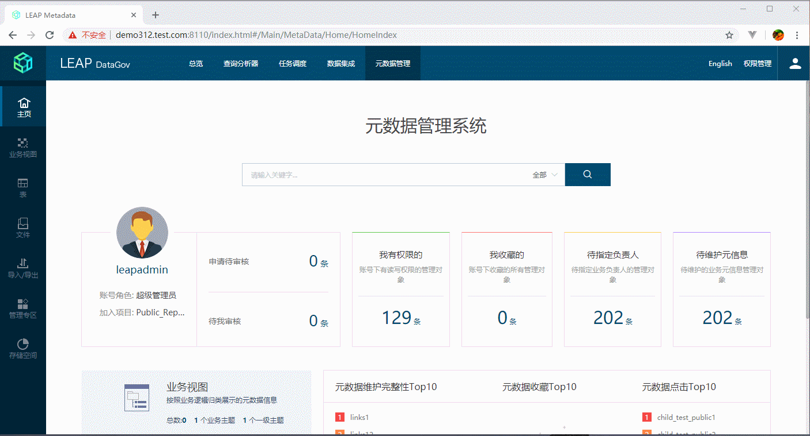
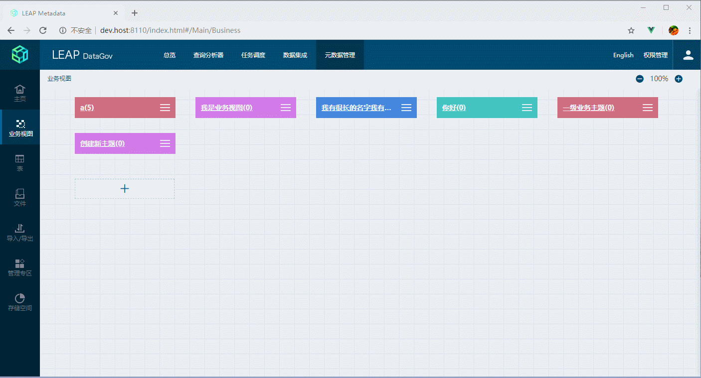
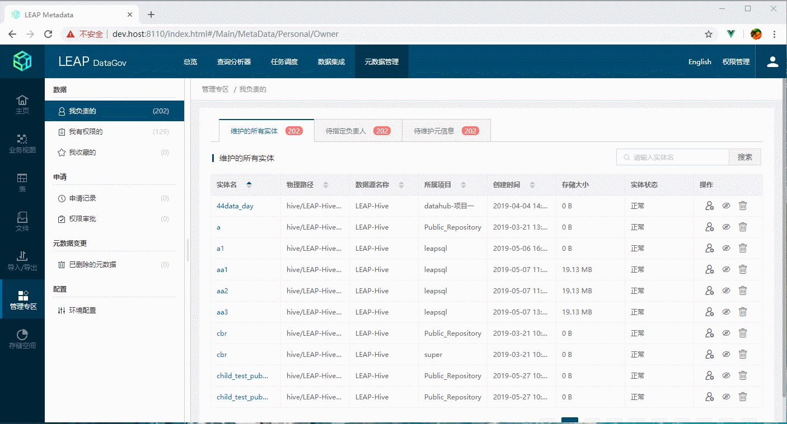
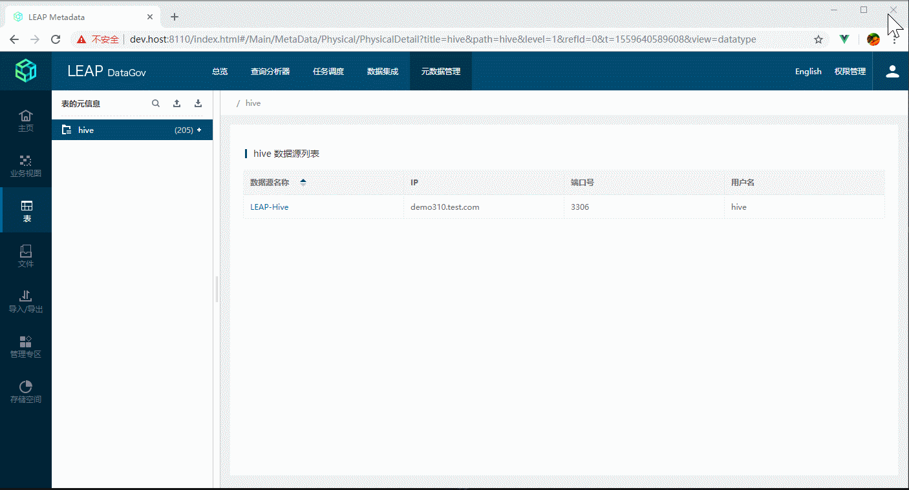
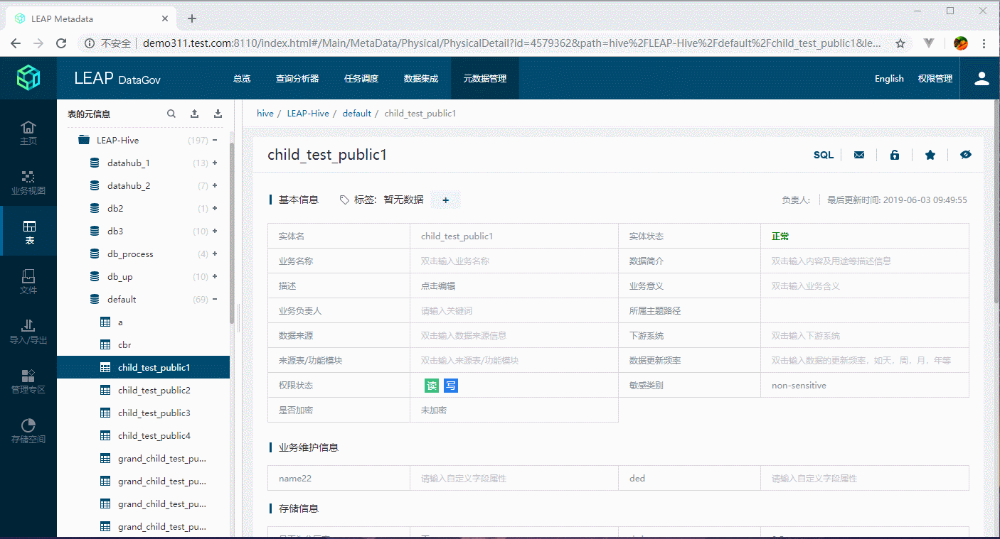
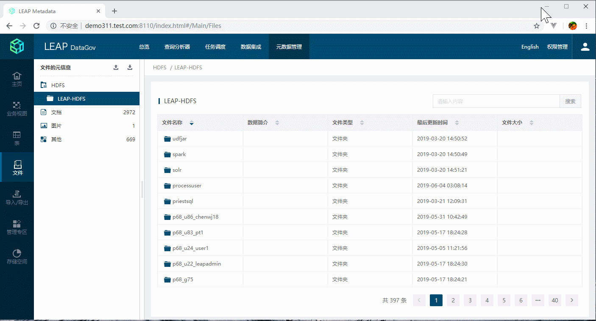
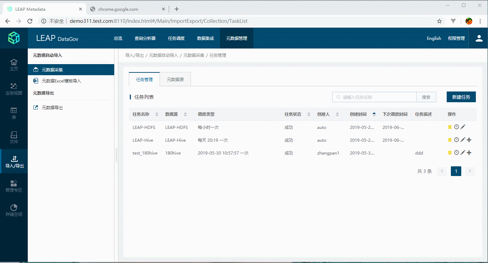
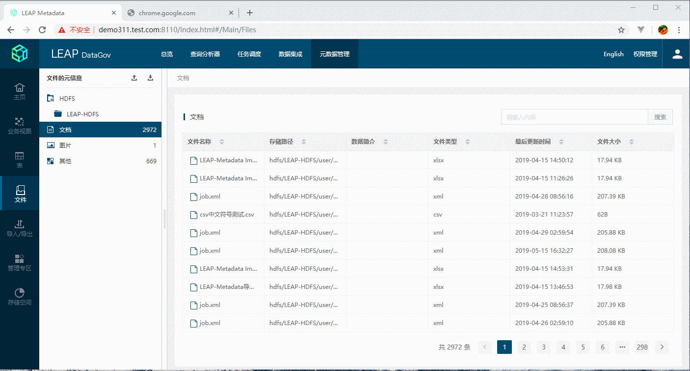
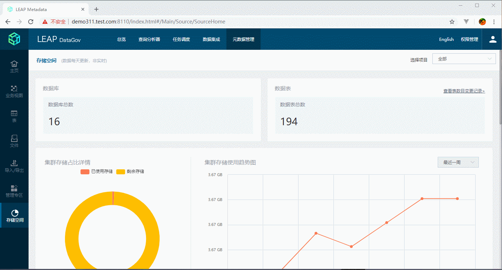

# 元数据资源管理系统

> wherehows

### 简介

   元数据管理系统（leap metadata）是用于企业内进行元数据管理的Web应用程序。该系统提供直观的用户页面。用户可以使用该系统管理企业所拥有的元数据，如查看元数据基本信息、数据所在位置、数据的血缘关系等。本系统支持管理员和普通用户的分级操作。
	
### 项目说明
   这个项目，是我和公司几个前端小伙伴一起完成了，项目比较大，周期比较长（大概用了2年时间）。也更新迭代了很多次，有些功能，是改了又改，所以经常变动。在做这个项目的时间里，学习了很多VUE的知识，也对VUE的数据更新，组件，
   指令，混合有了清晰的认识。项目有清晰的文件分类，功能划分，业务层次。比如把业务逻辑和数据持久化(Vuex)拆分开来。比如业务视图模块，文件夹src/components/Business下，Index.vue就是业务视图主页，下面文件夹children就包含
   了该模块需要用到子组件，和该路由下包含的子页面。路由和文件夹名称相对应。再如把请求的API，统一到src/components/service/getData.js文件下。把全局接口拦截器，统一到src/config/http.js文件
   
   
   有了这个大项目的基本，以后使用，运用VUE也更简单，更简易上手。对比以前用的jQuery项目，感觉VUE，方便太多了。
   #### vue特别适用的场景：
   1. 复杂数据操作的后数据
   2. 经常操作DOM的，更新数据的场景。
   3. 需要精确的控制，VUE的生命周期是合适的地方。
   4. 后台系统页面
   
   #### jquery适用的场景：
   1. html5的动画页面，
   2. js来操作页面样式的页面。
   3. 简单的多页面
   4. 官网展示页面
   
   如果二者结合起来一起使用的，vue侧重数据绑定，jquery侧重样式操作，动画效果等，则会更加高效率的完成业务需求。
   
   
   #### 除了VUE，和它有一样比较优秀的框架React，我总结了一下： react和vue的4点不同
   1. 数据是不是可变的
   2. 通过js操作一切还是各自的处理方式
   3. 类式的组件写法还是声明式的写法
   4. 什么功能内置，什么交给社区去做
   
### 技术栈
```
基于 vue2 + vue-router + vuex + axios + vue-i18n + ES6 + less 并使用webpack打包
```
### 使用项目
```
1.克隆项目：      git clone git@10.100.216.157:LEAP/Metadata.git
2.安装nodejs
3.安装依赖：      npm install
4.启动服务：      npm run dev
5.发布代码：      npm run build
6.单元测试：      npm run unit
7.e2e测试:       npm run e2e
8.测试：         npm test
```
### 部分截图










### 项目目录说明
```

├── build                                                    // webpack配置文件
├── config                                                   // 项目打包路径
├── index.html                                               // 入口html文件
├── package.json                                             //node安装包信息
├── README.md      
├── src                                                      //项目源代码目录
│   ├── App.vue                                              //页面入口文件
│   ├── assets                                               //静态资源目录
│   │   ├── css                                              //css目录
│   │   │   ├── common.css                                   //公共样式目录
│   │   │   └── elementUiEdit.less                           //自定义element UI 组件less样式
│   │   ├── element-theme                                    //element主题样式目录,scss文件
│   │   │   └── element-variables.scss                       //自定义主题样式
│   │   ├── font                                             //项目上用的一些字体图片
│   │   ├── images                                           //项目用到的图片
│   │   ├── js                                               //js库文件
│   │   │   └── go.js                                        //画血缘关系图用到的库
│   │   ├── less                                             //less文件
│   │   │   ├── Entry.less
│   │   │   ├── header.less
│   │   │   ├── metaData-nav.less
│   │   │   ├── metaData.less
│   │   │   ├── mixin.less
│   │   │   ├── source.less
│   │   │   └── vars.less
│   ├── components                                            //所有页面目录，对应路由表
│   │   ├── Business                                          //业务视图模块
│   │   │   ├── children 
│   │   │   │   ├── AddDataset.vue                            //业务视图中添加表和数据页面
│   │   │   │   ├── cascader                                  //重新的下拉选择框组件
│   │   │   │   │   └── src
│   │   │   │   │       ├── main.vue
│   │   │   │   │       └── menu.vue
│   │   │   │   └── children
│   │   │   │       ├── BusinessTree.vue                     //表和文件树组件
│   │   │   │       └── BusinessTreeItem.vue                 //表和文件树的子组件
│   │   │   └── Index.vue                                    //业务视图主页面
│   │   ├── common                                           //公共组件
│   │   │   ├── Cron.vue
│   │   │   ├── DatePicker.vue                               //日期选择公共组件
│   │   │   ├── dialogItemTitle.vue                          //弹出框公共组件
│   │   │   ├── Error.vue                                   
│   │   │   ├── index.js 
│   │   │   ├── ItemJump.vue                                //跳转到表和文件超链接子组件
│   │   │   ├── LineChart.vue                               
│   │   │   ├── Loading
│   │   │   │   ├── index.js
│   │   │   │   └── Loading.vue
│   │   │   ├── MoreLoading
│   │   │   │   ├── index.js
│   │   │   │   └── MoreLoading.vue
│   │   │   ├── NoData
│   │   │   │   ├── index.js
│   │   │   │   └── NoData.vue
│   │   │   ├── PieChart.vue
│   │   │   ├── RankList.vue
│   │   │   ├── Search.vue                                   //搜索公共组件
│   │   │   ├── SplitControler.vue
│   │   │   ├── TableHeader
│   │   │   │   ├── index.js
│   │   │   │   └── TableHeader.vue
│   │   │   └── TableItemJump.vue                           //跳转到表和文件超链接组件
│   │   ├── DataImport                                      //可以忽略些文件夹
│   │   │   ├── DataImport.vue
│   │   │   ├── DataImportJob.vue
│   │   │   ├── DataImportManual.vue
│   │   │   ├── DataImportRecord.vue
│   │   │   ├── DataImportTemplate.vue
│   │   │   ├── DataTreeDialog.vue
│   │   │   └── UploadItem.vue
│   │   ├── Files                                            //文件模块
│   │   │   ├── children
│   │   │   │   ├── ExportTree.vue                           //文件导出树组件
│   │   │   │   └── InputTag.vue                             //文件标签高级搜索组件
│   │   │   └── Index.vue                                    //文件模块主页面
│   │   ├── Footer.vue                                     
│   │   ├── Header.vue                                       //页面头组件
│   │   ├── Home                                             //主页模块
│   │   │   ├── Home.vue                                     //主页路由
│   │   │   ├── HomeIndex.vue                                //主页模块主页面
│   │   │   ├── HomeSearch.vue                               //主页搜索组件
│   │   │   ├── HomeTopList.vue                              //主页排行榜组件
│   │   │   ├── HomeUserInfo.vue                             //主页用户信息组件
│   │   │   ├── TopicTree.vue                                //废弃组件
│   │   │   └── TopicTreeItem.vue                            //废弃组件
│   │   ├── ImportExport                                     //导入/导出模块
│   │   │   ├── children
│   │   │   │   ├── children
│   │   │   │   │   ├── children
│   │   │   │   │   │   ├── BlackList.vue                     //黑名单组件
│   │   │   │   │   │   └── HdfsSource.vue                     //HDFS配置组件
│   │   │   │   │   ├── CompleteData.vue                       //已处理数据组件
│   │   │   │   │   ├── CreateTask.vue                         //创建任务页面
│   │   │   │   │   ├── DataImport.vue                         //数据导出页面
│   │   │   │   │   ├── HistoryList.vue                        //历史记录页面
│   │   │   │   │   ├── importHeaderItem.vue                  
│   │   │   │   │   ├── InsertData.vue                         //增加数据组件
│   │   │   │   │   └── TaskList.vue                           //任务列表页面
│   │   │   │   ├── Collection.vue                             //元数据采集路由页面
│   │   │   │   ├── Export.vue                                 //元数据导出路由页面
│   │   │   │   └── Import.vue                                 //元数据Excel模板导入路由页面
│   │   │   └── Index.vue                                      //入/导出组件主页面
│   │   ├── MainNav.vue                                        //左侧导航
│   │   ├── MainPage.vue                                       //右侧路由
│   │   ├── MetaData                                           //表模块
│   │   │   ├── DataImport
│   │   │   │   ├── DataImport.vue
│   │   │   │   ├── DataImportJob.vue
│   │   │   │   ├── DataImportManual.vue
│   │   │   │   ├── DataImportRecord.vue
│   │   │   │   ├── DataImportTemplate.vue
│   │   │   │   ├── DataTreeDialog.vue
│   │   │   │   └── UploadItem.vue
│   │   │   ├── Dataset                                        //表模块组件
│   │   │   │   ├── chiildren
│   │   │   │   │   └── TagDetail.vue                         //标签详情页
│   │   │   │   ├── Dataset.vue                               //表左侧树组件
│   │   │   │   ├── DatasetDetail                             //表详情组件
│   │   │   │   │   ├── BusinessDetail.vue                   //
│   │   │   │   │   ├── BusinessTree.vue
│   │   │   │   │   ├── BusinessTreeItem.vue
│   │   │   │   │   ├── children
│   │   │   │   │   │   └── LifeCycle.vue                     //tab生命周期
│   │   │   │   │   ├── Comments.vue                          //tab注释信息 
│   │   │   │   │   ├── DatabaseDetail.vue                    //库详情面
│   │   │   │   │   ├── DataHistory.vue                       //tab变更历史
│   │   │   │   │   ├── DataPermission.vue                   //tab权限信息
│   │   │   │   │   ├── DatasourceDetail.vue                 //数据源详情页
│   │   │   │   │   ├── DataTypeDetail.vue                   //数据源列表页
│   │   │   │   │   ├── Diagram.vue                          //tab血缘关系
│   │   │   │   │   ├── Dialog                               //弹窗组件
│   │   │   │   │   │   ├── CompareDialog.vue                //变更历史对比组件
│   │   │   │   │   │   └── TextDialog.vue                   //属性信息-描述富文本编辑
│   │   │   │   │   ├── PermissionItemL.vue                  //tab权限信息 子组件
│   │   │   │   │   ├── PermissionItemR.vue                  //tab权限信息 子组件
│   │   │   │   │   ├── PermissionList.vue                   //tab权限信息 列表组件
│   │   │   │   │   ├── Properties.vue                       //基本信息
│   │   │   │   │   ├── PropertiesEditor.vue                 //基本信息  双击编辑文本框子组件
│   │   │   │   │   ├── PropertyItem.vue                     //基本信息  编辑,提交,修改组件
│   │   │   │   │   ├── RelationalGraph.vue                  //血缘关系组件
│   │   │   │   │   ├── SampleData.vue                       //tab样本数据
│   │   │   │   │   ├── Schema.vue                           //基本信息  剩余字段
│   │   │   │   │   ├── Storage.vue                          //存储信息
│   │   │   │   │   ├── TableDetail.vue                      //表的详情页面,改变Tab页面
│   │   │   │   │   └── VersionControl.vue                       
│   │   │   │   ├── DatasetDetail.vue
│   │   │   │   ├── DatasetTree.vue                          //                        
│   │   │   │   ├── DatasetTreeHeader.vue
│   │   │   │   ├── DatasetTreeItem.vue
│   │   │   │   └── PhysicalExportTree
│   │   │   │       ├── PhysicalExportTree.vue
│   │   │   │       └── PhysicalExportTreeItem.vue
│   │   │   ├── MetaData.vue
│   │   │   ├── Nav.vue
│   │   │   ├── Personal                                     //管理专区模块
│   │   │   │   ├── chiildren
│   │   │   │   │   └── Search.vue                           ///管理专区公共搜索组件
│   │   │   │   ├── Personal.vue                             //管理专区主路由
│   │   │   │   ├── PersonalApproval.vue                     //权限审核页面 
│   │   │   │   ├── PersonalAuthority.vue                    //我有权限页面
│   │   │   │   ├── PersonalChargeMaintain.vue               //我负责的 - 待指定负责人  
│   │   │   │   ├── PersonalCollect.vue                      //我收藏的页面
│   │   │   │   ├── PersonalDel.vue                          //已删除的元数据页面
│   │   │   │   ├── PersonalMetaMaintain.vue                 //我负责的 - 待维护元信息表格  
│   │   │   │   ├── PersonalOwner.vue                        //我负责的页面
│   │   │   │   ├── PersonalOwnerTable.vue                   //我负责的 - 维护的所有实体表格
│   │   │   │   ├── PersonalRecord.vue                       //申请记录 页面
│   │   │   │   ├── Setting.vue                              //环境配置 页面
│   │   │   │   ├── Tag.vue                                  //标签页面
│   │   │   │   ├── TagDetail.vue                            //标签-标签详情子组件
│   │   │   │   └── TagList.vue                              //标签-标签列表子组件
│   │   │   ├── Search.vue
│   │   │   └── SearchResult.vue
│   │   └── Source                                                    //存储空间模块
│   │       ├── Detail                           
│   │       │   ├── NumberRecord.vue
│   │       │   ├── SourceDatabase.vue
│   │       │   └── SourceDataset.vue
│   │       ├── Source.vue                                            //存储空间主页面
│   │       ├── SourceHome.vue
│   │       └── SourceList.vue
│   ├── config                                                        //全局配置
│   │   ├── env.js                                                    //定义全局CODE,文字长度
│   │   ├── fetch.js                                                  //fetch模块
│   │   ├── http.js                                                   //axios请求和响应拦截器,全局报错提示
│   │   └── mUtils.js                                                 //全局工具函数
│   ├── directives                                                    //自定义指令
│   │   ├── clickoutside.js                                         
│   │   ├── ellipsis.js
│   │   ├── hiddenElement.js
│   │   └── index.js
│   ├── locale                                                        //中英文JSON文件
│   │   ├── en.js                                                     //英文JSON
│   │   ├── international.js                                          //vue-i18n 配置文件
│   │   └── zh.js                                                     //中文JSON
│   ├── main.js                                                       //项目主入口
│   ├── mixins                                                        //VUE混合
│   │   └── common.js
│   ├── plugins
│   │   ├── index.js
│   │   └── MessageBox
│   │       ├── main.js
│   │       └── MessageBox.vue
│   ├── router                                                          //路由配置
│   │   └── index.js
│   ├── service                                                         //后台请求数据API
│   │   └── getData.js
│   ├── store                                                          // vuex的状态管理
│   │   ├── actions.js                                                 // 配置actions
│   │   ├── index.js                                                   // 全局状态属性对象
│   │   ├── mutation-types.js                                          //定义常量muations名
│   │   └── mutations.js                                               //配置mutations
│   ├── utils                                                          //VUE工具函数
│   │   ├── bus.js                                                     //VUE 非父子,兄弟之间通信BUS实例
│   │   ├── index.js  
│   │   └── validator.js                                               //表单验证,公共正则表达式
│   └── vars.less                                                      //常量less
└── static                                                             //静态资源
    ├── a.json
    ├── alert.html                                                     //IE11以下,会跳转到这个页面
    ├── images                                                         //网页图标
    │   └── favicon.ico
    └── outdatedbrowser                                                 //中英方语言提示信息
    
```
